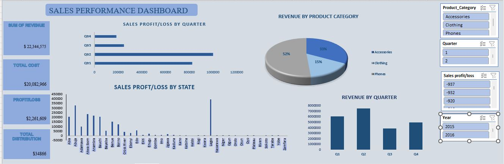
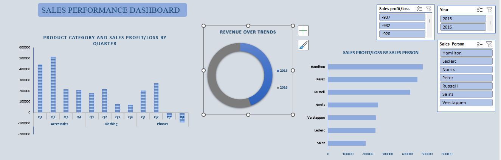
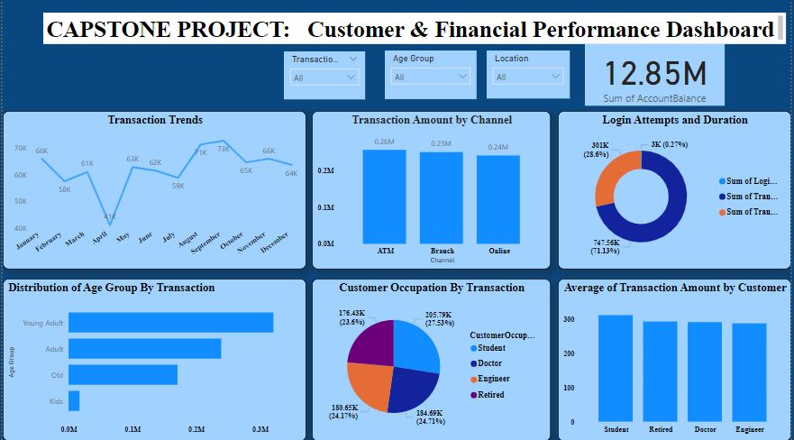
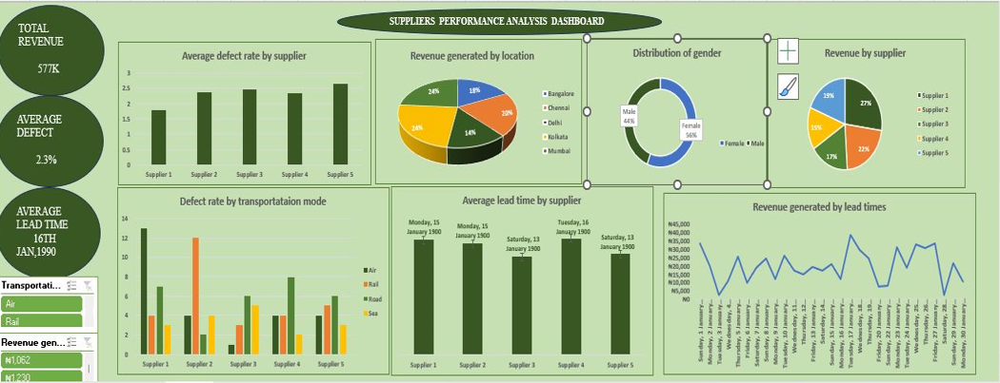
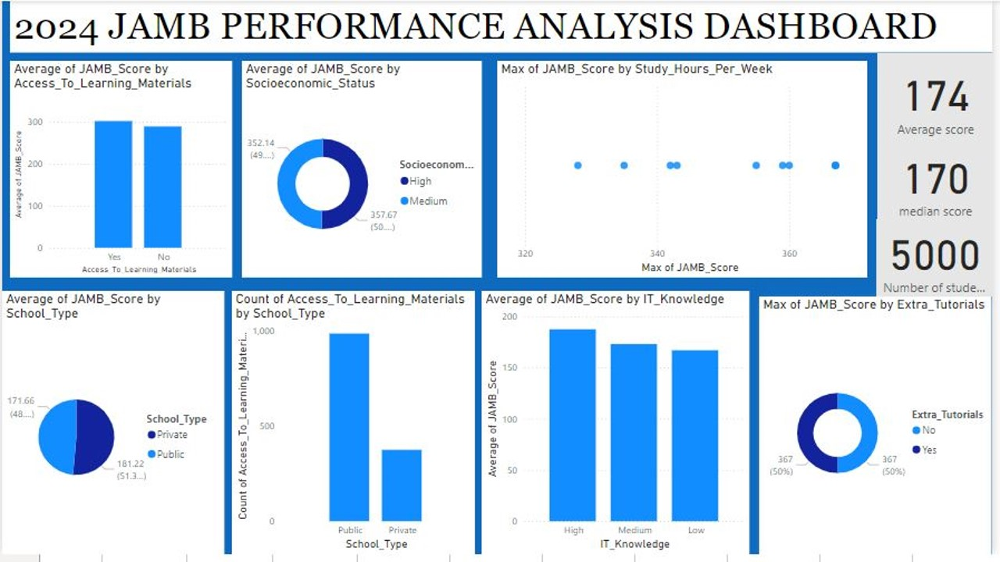
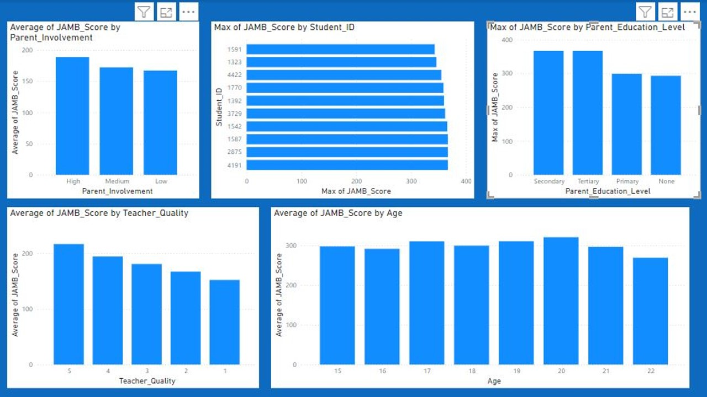

# Hi, I'm Aminat Adewuyi 👋
### Data Analyst | Business Intelligence Specialist

Welcome to my data portfolio! I specialize in turning raw data into actionable insights using advanced Excel modeling, data transformation, and dynamic dashboard design.

📬 **Connect with me:** [LinkedIn](https://www.linkedin.com/in/aminatadewuyi) | [Email](mailto:aminatabdulwasiu88@gmail.com)

---

## 🚀 Featured Data Projects

---

## 📈 Case Study 1: Sales & Revenue Performance
**Domain:** Commercial Retail Analytics & Business Intelligence  
**Core Technologies:** Advanced Excel | Dynamic Slicers | Pivot Tables & Charts | Data Cleaning  

### 🖥️ Dashboard Visualization

### 📝 Project Overview
This project involved developing a dynamic Sales Operations and Revenue Intelligence dashboard to analyze retail transaction flows, seasonal demand cycles, and regional sales performance. The project uncovers actionable insights into product purchasing behaviors, geographical market penetration, and talent productivity matrices to maximize retail profitability.

### 🔍 Deep-Dive Analytical Insights & Business Impact
* **Revenue Concentration Risk & Upgrade Cycles:** Product Category analysis shows that **Phones command the dominant revenue share (55%)**, driven by a predictable 2-to-3-year consumer hardware upgrade cycle. Conversely, **Accessories lead in total unit transaction volume (33% revenue share)**. Because accessories function as high-margin, impulse-buy items, overall retail profitability depends on cross-selling accessories alongside primary phone sales.
* **Cyclical Performance & Q4 Revenue Compression:** A longitudinal trend analysis identifies a sharp **macro sales velocity peak in Q2, followed by a significant revenue compression by Q4**. This drop indicates strong seasonal cyclicality or inventory exhaustion. Businesses must deploy strategic Q3/Q4 promotional campaigns to smooth out this dip and protect cash flow.
* **Demographic Density & Regional Market Dominance:** **Lagos State emerged as the hyper-dominant regional sales hub**. This performance is a direct result of urban density combined with an immediate consumer need for hardware protection accessories (e.g., screen guards, fast-charging units). 
* **Salesperson Productivity Profiling:** **Hamilton was isolated as the top-performing sales agent**, serving as a benchmark for high-value client retention. Standardizing Hamilton's customer-centric sales methodologies can serve as an internal training template to optimize underperforming territories.

---

## 🛡️ Case Study 2: Fintech Customer Experience & Fraud Risk Analytics
**Domain:** Fintech, Behavioral Segmentation, & Operational Risk Management  
**Core Technologies:** Power BI | DAX | Advanced Cohort Analysis | Security Threat Modeling  

### 🖥️ Dashboard Visualization

### 📝 Project Overview
Engineered an enterprise Fintech Customer Experience & Fraud Risk Analytics engine utilizing a complex transactional database of **2,512 unique financial records across 16 behavioral attributes**. This system maps demographic spending cohorts directly against platform operational health, user behavior, and security threat compliance.

### 🔍 Deep-Dive Analytical Insights & Business Impact
* **Channel Utilization & Infrastructure Costs:** Quantitative evaluation reveals that **physical ATMs remain the primary transactional touchpoint** over Online and POS frameworks. This deep reliance on cash transactions indicates an opportunity to migrate users toward low-cost digital channels to save on branch operation and cash-transit logistics.
* **Lifecycle Financial Stratification (Age Cohorts):**  **The 18–30 Cohort (Young Adults):** Exhibit high-velocity, low-ticket-size lifestyle spend patterns. Crucially, this group also contains **high-value outlier spikes**, making them highly susceptible vectors for credential theft or sudden high-risk credit exposure.
  * **The 30–50 Cohort (Mid-Career Professionals):** Form the bank’s core profitability engine, maintaining the highest average account balances and steady volume metrics.
* **Securing the Transactional Ecosystem:** Built an active anomaly detection logic. **Accounts experiencing more than 3 failed login attempts are instantly isolated** as active security vulnerabilities (brute-force hacking vectors vs. user error). By combining this threshold with geographic logging (which identified **Colorado Springs** as the densest transaction node), the system flags out-of-pattern IP logins to prevent account takeovers.

---

## 📦 Case Study 3: Supply Chain & Supplier Performance Optimization
**Domain:** Logistics, Quality Assurance, & Procurement Management  
**Core Technologies:** Excel | Procurement Performance Audit | Operational Reporting 

### 🖥️ Dashboard Visualization

### 📝 Project Overview
Designed a comprehensive Supply Chain Performance Optimization model to audit vendor reliability, supply network volatility, and manufacturing quality metrics. This data architecture empowers operational stakeholders to mitigate production downtime, evaluate geographical supplier risks, and tighten Procurement SLAs (Service Level Agreements).

### 🔍 Deep-Dive Analytical Insights & Business Impact
* **Geographical Lead Time Variance:** Granular tracking of **Average Lead Time by Vendor** reveals critical delivery delays that are highly localized to specific manufacturing regions or complex cross-border shipping routes. These delivery variances create sudden factory stockout risks, requiring the establishment of safety stock margins for volatile vendors.
* **Defect Rate Volatility & Waste Allocation:** Quality audits show a **highly erratic distribution of Defect Rates across the supplier network**. High defect percentages from particular regions drain operating margins via product scrap costs, return shipping fees, and factory rework loops. 

---

## 🎓 Case Study 4: Educational Policy & Socio-Economic Performance Dashboard
**Domain:** Public Sector Analytics, Demographics, & Public Policy Evaluation  
**Core Technologies:** Power BI | Educational Data Modeling | Statistical Disparity Analysis  

### 🖥️ Dashboard Visualization

### 📝 Project Overview
Developed a Public Policy and Educational Demographics dashboard analyzing a dataset of **5,000 national testing profiles**. This project builds statistical models to show how socio-economic standing, institutional funding, teacher quality, and student behavior directly influence high-stakes examination testing outcomes.

### 🔍 Deep-Dive Analytical Insights & Business Impact
* **Socio-Economic Stratification & Rural Facility Voids:** The analysis exposes deep institutional inequities, with **maximum test score outcomes concentrated heavily in Urban centers** due to unequal funding and resource access. Furthermore, a **0.78% performance gap persists between High and Low Socio-Economic Status (SES) cohorts** (50.39% vs 49.61%), proving that household income structures long-term learning outcomes across macro-populations.
* **Isolating Academic Success Catalysts:** Predictive data modeling isolated **weekly study hours and tutorial access** as the most powerful drivers of student success. Specifically, **50% of elite students scoring above 300 points utilized extra tutorial structures**, and a clear threshold of **26+ hours of independent weekly study** reliably predicted top-tier testing results.
* **The Teacher Instructional Quality Matrix:** The dashboard maps a direct, linear drop in student scores as **Teacher Quality ratings decline from 5 down to 1**. Private institutions hold a structural monopoly on modern learning materials, highlighting the urgent need for targeted teacher upskilling programs in underfunded public sectors to stabilize national test outcomes.
